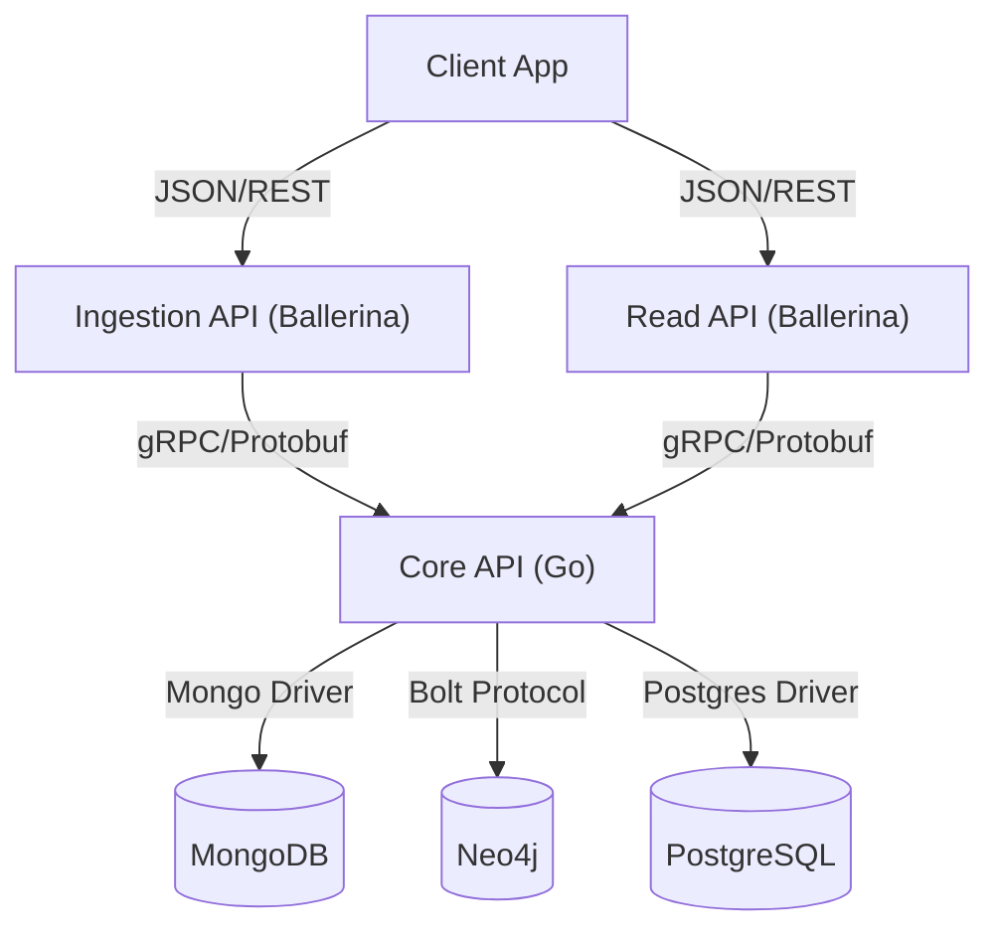

# OpenGIN Architecture

## High-Level Overview

OpenGIN follows a microservices architecture with a clear separation of concerns between the API layer, the Core logic layer, and the Storage layer.

## Components

### 1. Ingestion API (Ballerina)
- **Role**: Entry point for writing data.
- **Port**: 8080
- **Function**: Validates JSON input, converts it to Protobuf `Entity` messages, and forwards them to the Core API.
- **Key Files**: `opengin/ingestion-api/`

### 2. Read API (Ballerina)
- **Role**: Entry point for reading data.
- **Port**: 8081
- **Function**: Accepts read requests, forwards them to Core API via gRPC, and converts the returned Protobuf `Entity` to JSON.
- **Key Files**: `opengin/read-api/`

### 3. Core API (Go)
- **Role**: Central processing unit.
- **Port**: 50051 (gRPC)
- **Function**: 
    - Orchestrates data operations across databases.
    - Ensures data consistency (e.g., if Neo4j write fails, it handles the error).
    - Implements business logic.
- **Key Files**: `opengin/core-api/`

### 4. Storage Layer
- **MongoDB**: Stores `Metadata` (unstructured key-value pairs).
    - fast read/write for document data.
- **Neo4j**: Stores `Entities` (Nodes) and `Relationships` (Edges).
    - efficient graph traversal.
- **PostgreSQL**: Stores `Attributes` (Time-series data).
    - structured, time-based querying.

## Data Flow (Write)

1. **Ingest**: Client sends JSON to Ingestion API.
2. **Convert**: Ingestion API converts JSON -> Protobuf.
3. **Transmit**: Protobuf sent to Core API via gRPC.
4. **Persist**: Core API writes to:
    - MongoDB (Metadata)
    - Neo4j (Entity Node & Relationships)
    - PostgreSQL (Attributes)

## Data Flow (Read)

1. **Request**: Client requests Entity ID from Read API.
2. **Fetch**: Read API requests Entity from Core API.
3. **Aggregate**: Core API fetches data from all 3 DBs in parallel (conceptually) and assembles the `Entity` object.
4. **Return**: Core API returns Protobuf -> Read API converts to JSON -> Client.
